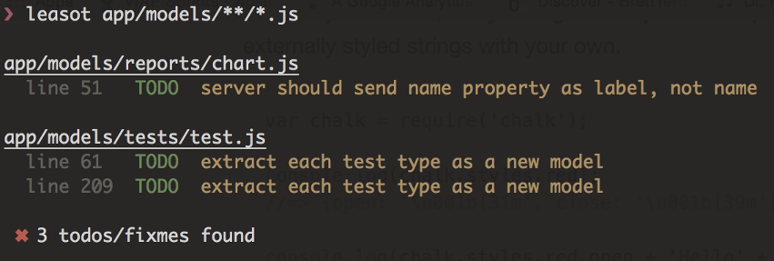

# leasot
> Parse and output TODOs and FIXMEs from comments in your files

[](https://npmjs.org/package/leasot)
[](https://npmjs.org/package/leasot)
[](https://travis-ci.org/pgilad/leasot)

Easily extract, collect and report TODOs and FIXMEs in your code. This project uses regex in order
to extract your todos from comments.



## Comment format

`TODO: add some info`

- Spaces are optional
- Colon is optional
- Must be in a comment (line or block) in its' own line (`some code(); //TOOD: do something` is not supported)
- Spaces are trimmed from comment text
- Supported types are `TODO` and `FIXME` - case insensitive

## Supported languages:

| Filetype     | Extension       | Notes                                           |
| ------------ | --------------- | ------------------------------------------------|
| Coffeescript | `.coffee`       | using regex. Supports `#` comments.             |
| Coffee-React | `.cjsx`         | using regex. Supports `#` comments.             |
| Handlebars   | `.hbs`          | using regex. Supports `{{! }}` and `{{!-- --}}` |
| Twig         | `.twig`         | using regex. Supports `{#  #}` and `<!-- -->`   |
| Jade         | `.jade`         | using regex.                                    |
| Javascript   | `.js`           | using regex. Supports `// and /* */` comments   |
| Sass         | `.sass` `.scss` | using regex. Supports `// and /* */` comments.  |
| Stylus       | `.styl`         | using regex. Supports `// and /* */` comments.  |
| Typescript   | `.ts`           | using regex. Supports `// and /* */` comments.  |
| Less         | `.less`         | using regex. Supports `// and /* */` comments.  |
| Jsx          | `.jsx`          | using regex. Supports `// and /* */` comments.  |

Javascript is the default parser.

**PRs for additional filetypes is most welcomed!!**

## Usage

### Command Line

#### Installation

```bash
$ npm install --global leasot
```

#### Examples

```bash
❯ leasot --help

  Usage: leasot [options] <file ...>

  Parse and output TODOs and FIXMEs from comments in your files

  Options:

    -h, --help                 output usage information
    -V, --version              output the version number
    -t, --filetype [filetype]  Force the filetype to parse. Useful for streams (Default: .js)
    -r, --reporter [reporter]  Use reporter (table|json|xml|markdown|raw) (Default: table)

  Examples:

    $ leasot index.js
    $ leasot **/*.js
    $ leasot index.js lib/*.js
    $ leasot --reporter json index.js
    $ cat index.js | leasot
    $ cat index.cjsx | leasot --filetype .coffee
```

### Programmatic

#### Installation

```bash
$ npm install --save-dev leasot
```

#### Examples

```js
var fs = require('fs');
var leasot = require('leasot');

var contents = fs.readFileSync('./contents.js', 'utf8');
// get the filetype of the file, or force a special parser
var filetype = path.extname('./contents.js');
// add file for better reporting
var file = 'contents.js';
var todos = leasot.parse(filetype, contents, file);

// -> todos now contains the array of todos/fixme parsed

var output = leasot.reporter(todos, {
    reporter: 'json',
    spacing: 2
});

console.log(output);
// -> json output of the todos
```

### Build Time

* [gulp-todo](https://github.com/pgilad/gulp-todo)


## API

```js
var leasot = require('leasot');
```

`leasot` exposes the following API:

### .isExtSupported(extension)

Check whether extension is supported by parser.

Specify an extension including the prefixing dot, for example:

`leasot.isExtSupported('.js'); //-> true`

**Returns**: `Boolean`

### .parse(extension, contents, filename)

Parse the contents, using the provided `extension`. `filename` will be attached
to the return object, so it is recommended to use it if you know it.

`extension` is the extension to parse as, including a prefixing dot.

`contents` is a string containing the contents to parse.

`filename` is an optional string.

**Returns**: `Array` of comments.

```js
[{
    file: 'parsedFile.js',
    text: 'comment text',
    kind: 'TODO',
    line: 8
}]
```

### .reporter(comments, config)

Use the specified reporter to report the comments.

`comments` is the array of comments received from `leasot.parse()`.

`config` is an object that will also be passed to the reporter itself (allowing custom options for each reporter).

It may also contain the specified reporter:

#### config.reporter

Can be a string indicating the [built-in reporter](#built-in-reporters) to use,
 or an external library used as a reporter.

Could also be a custom function `(comments, config)`

**Type**: `String|Function`

**Required**: `false`

**Default**: `raw`

## Built-in Reporters

- json
- xml
- raw
- table
- markdown

Each reporter might contain config params that are useful only for that reporter:

### Markdown

Returns a markdown version of the todos.

### Options

#### newLine

How to separate lines in the output file. Defaults to your OS's default line separator.

**Type**: `String`

**Default**: `Your system default line feed`

### padding

How many `newLine`s should separate between comment type blocks.

**Type**: `Number`

**Default**: `2`

**Minimum**: `0`

### transformHeader(kind)

Control the output of a header for each comment kind (*i.e todo, fixme*).

**Type**: `Function`

**Default**:
```js
transformHeader: function (kind) {
    return ['### ' + kind + 's',
        '| Filename | line # | ' + kind,
        '|:------|:------:|:------'
    ];
}
```

**kind**: will be be passed as the comment kind (todo/fixme).

**Returns**: `String[]|String`

You are expected to return either an `Array of strings` or just a `string`. If you return an array - each item will be separated by a newline in the output.

### transformComment(file, line, text, kind)

Control the output for each comment.

**Type**: `Function`

**Default**:
```js
transformComment: function (file, line, text, kind) {
    return ['| ' + file + ' | ' + line + ' | ' + text];
},
```

**file**: filename the comment was in.

**line**: line of comment.

**text**: comment text

**kind**: will be be passed as the comment kind (todo/fixme).

**Returns**: `String[]|String`

You are expected to return either an `Array of strings` or just a `string`. If you return an array - each item will be separated by a newline in the output.

### Table

Returns a pretty formatted table of the todos.

### Raw

Just returns the raw javascript todos

### JSON

Return a JSON valid representation of the todos.

#### Options

##### spacing

Type: `Number`

Default: `2`

### XML

Return an unformatted XML valid representation of the todos.

Parsed using [json2xml](https://github.com/estheban/node-json2xml)

#### Options

##### header

Whether to include xml header

Type: `Boolean`

Default: `true`

##### attributes_key

See https://github.com/estheban/node-json2xml#options--behaviour

Type: `Boolean`

Default: `undefined`

## License

MIT ©[Gilad Peleg](http://giladpeleg.com)
